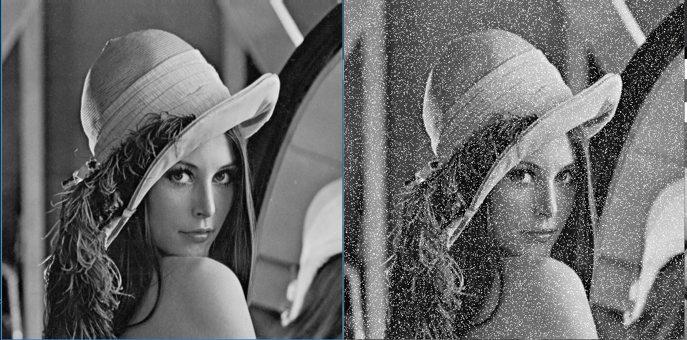
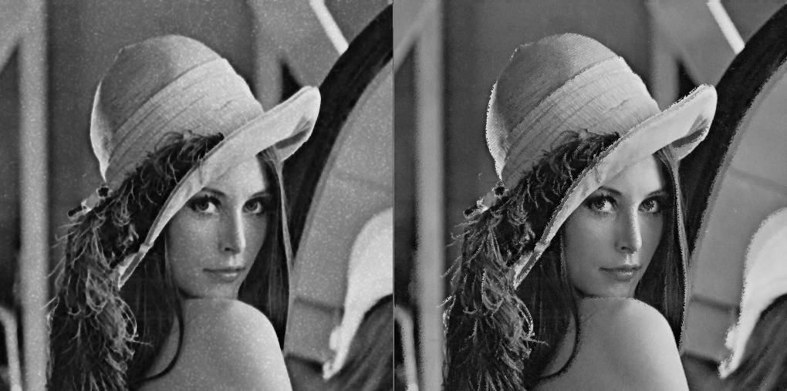

# 数字图像处理报告

## 摘要：

本文将利用VS平台和c++ 以及Opencv开源库对图像进行一系列操作，包括含高斯噪声的图像的复原，含椒盐噪声图像的复原以及利用维纳滤波及约束最小二乘方滤波进行图像复原

## 题目一：含高斯噪声的图像的复原

### 1.高斯噪声简介

  高斯噪声是指它的概率密度函数服从高斯分布（即正态分布）的一类噪声。特别的，如果一个噪声，它的幅度分布服从高斯分布，而它的功率谱密度又是均匀分布的，则称这个噪声为高斯白噪声。高斯白噪声的二阶矩不相关，一阶矩为常数，是指先后信号在时间上的相关性。高斯白噪声包括热噪声和散粒噪声。高斯噪声完全由它的时变平均值和两瞬时的协方差函数来确定，若噪声是平稳的，则平均值与时间无关，而协方差函数则变成仅和所考虑的两瞬时之差有关的相关函数，在意义上它等同于功率谱密度。高斯噪声可以由大量独立的脉冲产生，从而在任何有限时间间隔内，这些脉冲中的每一个脉冲值与所有脉冲值的总和相比都可忽略不计。常见的高斯噪声包括起伏噪声、宇宙噪声、热噪声和散粒噪声等等。除常用抑制噪声的方法外，对高斯噪声的抑制方法常常采用数理统计方法。如图所示这是高斯噪声的概率公式。

### 2.处理结果

   这部分将分别使用算术均匀滤波，几何均值滤波，逆谐波均值滤波，中值滤波，自适应中值滤波来处理添加了方差为10，均值为0高斯噪声的图片。结果如下。

左为原图，右为加了噪声的图片

左为算术均匀滤波，右为几何均值滤波

左为逆谐波均值滤波，右为自适应中值滤波

### 3.结果分析

  因为加入的噪声方差比较小，可见所有的滤波器都较好的在一定程度上去除了噪声，但是在细节上有些区别。算术均匀滤波可以看到使图像变得更加模糊，而其他的滤波器更加清晰。对于自适应中值滤波，我们可以看到虽然噪声比较有效地被消除，但是图像的连接处出现了失真和断裂，同时细节也同样有些失真。

## 题目二：含椒盐噪声的图像的复原

### 1.椒盐噪声简介

   椒盐噪声，椒盐噪声又称脉冲噪声，它随机改变一些像素值，是由图像传感器，传输信道，解码处理等产生的黑白相间的亮暗点噪声。椒盐噪声往往由图像切割引起。噪声脉冲可以为正也可以为负。在一副图像中脉冲噪声通常被数字化为最大值（纯黑或纯白），负脉冲以一个黑点（胡椒点）出现在图像中，正脉冲以白点（盐粒点）出现在图像中。本人的程序at addSaltNoise(Mat p, double r,int type)但type为1时为盐粒点，为2为胡椒点。

### 2.结果处理

#### 加入盐噪声

左为原图，右为加了噪声的图片

左为算术均匀滤波，右为几何均值滤波

左为逆谐波均值滤波，右为自适应中值滤波

注：左边的逆谐波滤波的阶数为1.5

左为逆谐波均值滤波，右为自适应中值滤波

注：左边的逆谐波滤波的阶数为-1.5

#### 加入椒噪声

注：图片排序和上一样

### 3.结果分析

   我们可以看到对于盐噪声，中值滤波和逆谐波均值滤波比其他的滤波器的效果好很多。对于椒噪声，逆谐波滤波的比其他滤波器的性能好很多。但是同时逆谐波滤波也有缺点，即必须知道噪声是暗噪声还是亮噪声，以选择好的阶数，如果选错，我们可以看到结果是灾难性的。同时由于其原理，自适应中值和几何均值滤波也非常不适合椒噪声的处理。

## 题目三：利用维纳滤波及约束最小二乘方滤波进行图像复原

### 1.图像复原简介

  图像复原是一个客观的过程，针对质量降低或失真的图像，试图恢复其原始的内容或质量。复原技术是面向退化模型的，并且采用相反的过程进行处理，以便恢复出原图像。在进行图像复原之前要先建立起其退化模型，根据该模型进行图像复原。课本中的图像退化过程建模为一个退化函数和一个加性噪声。

 

  假设H是一个线性时不变的过程，则我们可以得到，式子中的“*”表示卷积。其频率域的表示为：。 

### 2.运动模糊模型

在这个模型中，图像获取时被图像和传感器之间的均匀线性运动模糊了，假设图像f(x,y)进行平面运动，如果运动变量已知，假设图像在x方向已给定速度at/T做匀速直线运动，y速度为bt/T，则有以下退化函数。

 

我们可以得到退化图片：（a=b=0.05，T=1）

### 3.维纳滤波简介及处理

    维纳滤波也称最小均方误差滤波，它能处理被退化函数退化和噪声污染的图像。该滤波方法建立在图像和噪声都是随机变量的基础之上，目标是找到未污染图像f(x,y)的一个估计，使它们之间的均方误差最小，在假设噪声和图像不相关，其中一个或另一个有零均值，且估计中的灰度级是退化图像中灰度级的线性函数的条件下，均方误差函数的最小值在频率域由如下表达式给出：

                                                  

其中，H(u,v)为退化函数，H*(u,v)为H(u,v)的复共轭，|H(u,v)|^2=H(u,v)H*(u,v)，Sη(u,v)=|N(u,v)|^2=噪声的功率谱，Sf(u,v)=|F(u,v)|^2=未退化图像的功率谱，H(u,v)是退化函数的傅里叶变换，G(u,v)是退化后图像的傅里叶变换。

        从上面的公式可以发现，如没有噪声，即Sη(u,v)=0，此时维纳滤波变为直接逆滤波，如有噪声，那么Sη(u,v)如何估计将成问题，同时Sf(u,v)的估计也成问题。在实际应用中假设退化函数已知，如果噪声为高斯白噪声，则Sη(u,v)为常数，但Sf(u,v)通常难以估计。一种近似的解决办法是用一个系数K代替Sη(u,v)/Sf(u,v)，因此上面的公式变为如下式所示：

 

对上述运动模糊之后的图像加入高斯噪声再进行维纳滤波可得以下图像

上为参数选择错误

                                                          

### 4.约束最小二乘滤波简介及处理

 一个图像采集系统输入输出的关系可以表示为g(x,y)=H[f(x,y)]+η(x,y)，表达为向量-矩阵形式为g=Hf+η，明确地以矩阵形式来表达问题可以简化复原技术的推导。约束最小二乘方滤波的核心是解决退化函数H对噪声的敏感性问题，而减少噪声敏感性问题的一种方法是以平滑度量的最佳复原为基础的，如图像的二阶导数即拉普拉斯变换。于是，我们找到一个带约束条件的最小准则函数C，定义如下：

                                          

其约束条件为

                                                   

其中，是欧几里德向量范数，是未退化图像的估计。是拉普拉斯算子。求函数C的最小值，便得到最好的平滑效果即最佳复原。怎样找到最小值呢，这里我们采用拉格朗日乘数法，将拉格朗日方程转化成频域，并对其求导可得以下滤波方程：

 

其中P(u,v)为拉普拉斯算子的频谱函数。

   处理之后图像如下：

上为参数选择错误

### 5.结果分析

  比较约束最小二乘方滤波和维纳滤波的结果，发现前者对于高噪声和中等噪声的情况，结果会好一些，而低噪声则差不多。当手工选择参数时，约束最小二乘方滤波的效果有可能比维纳滤波效果更好。同时如果在维纳滤波的噪声比值估计错误时仍然会有大的噪音。

​                                                           

